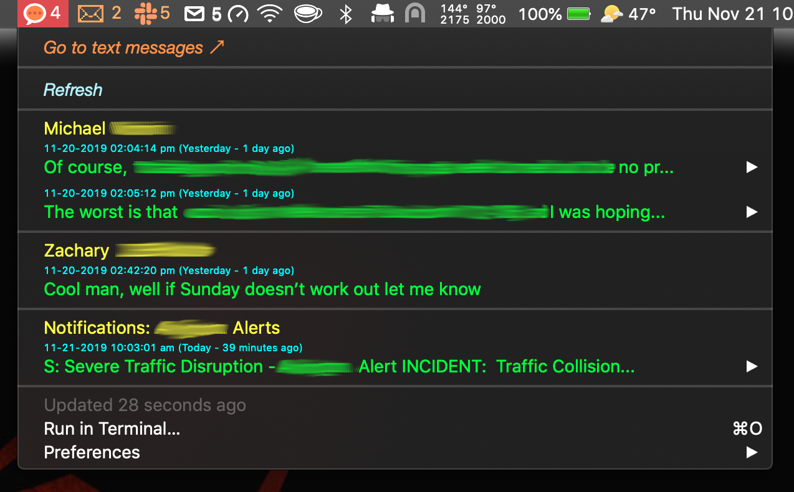
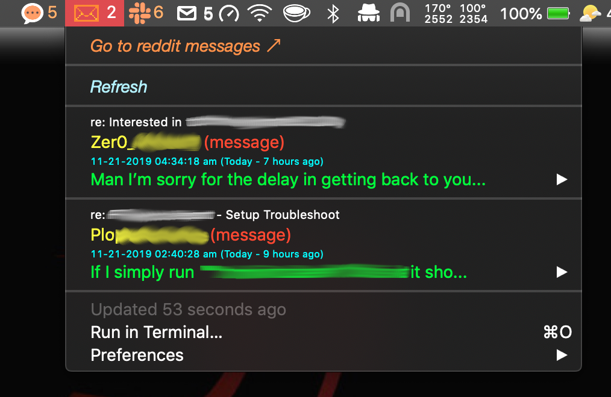

# macOS Menubar Plugins

Collection of plugins originally written for the BitBar macOS menubar application, found [here](https://getbitbar.com), but now adapted to run in the SwiftBar macOS menubar application found [here](https://swiftbar.app) ([https://github.com/swiftbar/SwiftBar](https://github.com/swiftbar/SwiftBar))

## macOS iMessage/SMS Text Message Notifier

Menubar plugin to display macOS iMessage/SMS messages in the menubar.

---

## Reddit Message Notifier

Menubar plugin to display reddit inbox messages in the menubar.

---
