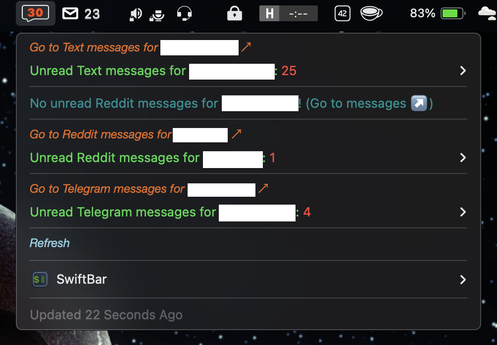
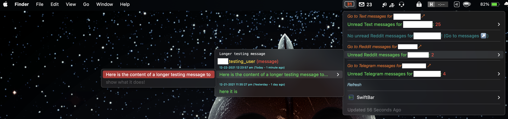

# macOS Menubar Plugins

Collection of plugins originally written for the BitBar macOS menubar application, found [here](https://getbitbar.com), but now adapted to run in the SwiftBar macOS menubar application found [here](https://swiftbar.app) ([https://github.com/swiftbar/SwiftBar](https://github.com/swiftbar/SwiftBar))

---

## Table of Contents
* [Message Notifier](#message-notifier)
  * [Examples](#message-notifier-examples)
  * [Dependencies](#message-notifier-dependencies)
  * [Setup](#message-notifier-setup)
  
---

<a name="message-notifier"></a>
## Message Notifier

The Message Notifier currently supports retrieval of unread messages from the following services:

* macOS iMessage/SMS
* [Reddit](https://www.reddit.com)
* [Telegram](https://telegram.org)

<a name="message-notifier-examples"></a>
### Message Notifier Examples





<a name="message-notifier-dependencies"></a>
### Message Notifier Dependencies

The Message Notifier requires Python 3.6+, which can be built from source, installed via Homebrew, or installed using `pyenv` *(recommended)*.

Before installing the Python dependencies, you will need to install several Homebrew packages by running:
```shell
brew install libffi libheif
```

Next, install all Python dependencies found in [requirements.txt](requirements.txt) by running:
```shell
pip install -r requirements.txt
```

Additional third-party dependencies:
 
* [terminal-notifier](https://github.com/julienXX/terminal-notifier)*: can be installed by running:
    ```shell
    brew install terminal-notifier
    ```
* [MediaInfo](https://apps.apple.com/us/app/mediainfo/id510620098)*: can be installed from the macOS App Store (costs $0.99)

*The developer of the Message Notifier plugin for SwiftBar is ***NOT*** affiliated with any of these third-party projects.

<a name="message-notifier-setup"></a>
### Message Notifier Setup

In order to retrieve unread messages from supported services, you must follow these steps:

* Make a copy of [resources/credentials/EXAMPLE-private.json](resources/credentials/EXAMPLE-private.json) and *rename* that copy to just `private.json`.
* Remove any sections for messaging services you do not plan to use.
* For all remaining services, replace the respective dummy values with their real counterparts.
  * For iMessage/SMS, you will simply need your macOS username.
  * For Reddit, you will need to log in to your account(s), create an [app](https://ssl.reddit.com/prefs/apps/) for each account, and copy the values into `private.json`.
  * For Telegram, you will need to follow the instructions [here](https://core.telegram.org/api/obtaining_api_id) to create an App ID, and copy the values in to `private.json`.

Additionally, both Reddit and Telegram use tokens to prevent you having to re-authenticate your app every time you query them, so in order to get the Reddit refresh token and the Telegram session string, you must run the respective scripts found in [resources/scripts](resources/scripts):

* Reddit: [get_reddit_refresh_token.py](resources/scripts/get_reddit_refresh_token.py)
* Telegram: [get_telegram_session_string.py](resources/scripts/get_telegram_session_string.py)

---
